# Jenkins入门的第一篇文章

简介：Jenkins是非常好友的自动化构建与发布项目的工具。我整理了一些基本概念和有用的插件，写了这篇入门教程。通过阅读这篇文章，你能感受到Jenkins是什么东西，能为你做什么，并且在文章最后，我附上了Jenkins的一个实践方案。

## 目录

 * 安装Jenkins
 * 项目代码一键发布架构设计
 * 多用户与权限管理
 * 消息通知
 * Jenkins Master/Slave 架构
 * 使用 Jenkins 一键发布 Node.js 的项目
 
## 安装Jenkins

十分推荐使用Docker进行安装，快速高效。

	docker run -p 8080:8080 -p 50000:50000 jenkins
	
执行上面的命令，Docker会将Jenkins最新的镜像版本（latest）拉到本地并启动容器，同时监听主机的8080和50000端口。

[技巧]：执行该命令默认从官方（国外的服务器）拉取镜像，拉取时间较长（也可能因为网络原因导致拉取失败）。推荐使用阿里云的镜像加速器，关于加速器，可以点击[这里](https://yq.aliyun.com/articles/29941)了解。如果你只是试验性地实用Jenkins，而非用于生产环境，使用阿里云的事例镜像是最快的方法，镜像地址：registry.cn-hangzhou.aliyuncs.com/acs-sample/jenkins:2.60.3

在上面的命令执行完之后，可以在控制台末看到

	INFO: Finished Download metadata. xxx ms 

即镜像拉取完毕且容器创建成功。

打开浏览器访问 http://127.0.0.1:8080，可以看到 Jenkins 已成功运行：

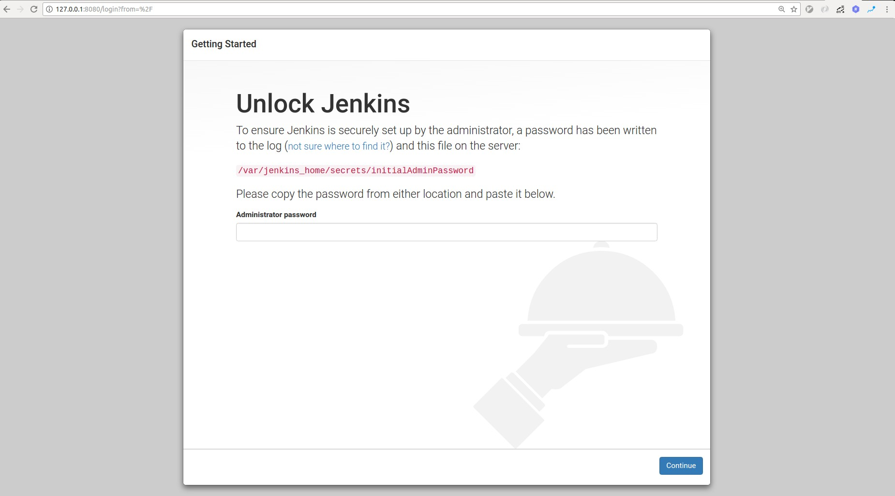

欢迎来到Jenkins的世界。

上面的页面中提到，需要获得 Jenkins 的密码来解锁，密码存储在 /var/jenkins_home/secrets/initialAdminPassword 这个文件中。

通过下面的命令进入 Jenkins 的容器

	docker exec -it ${容器id} /bin/bash
	
通过下面的命令获得锁解锁密码

	cat /var/jenkins_home/secrets/initialAdminPassword
	
将密码填入输入框后，点击 [Continue] 进入下面的页面。

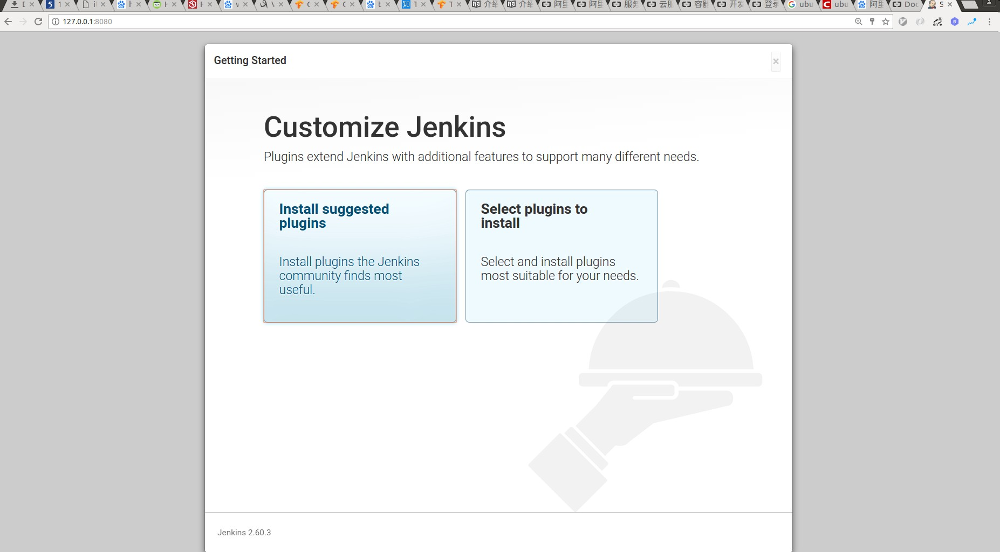

在还不了解Jenkins的情况下，使用Jenkins建议的插件。

点击 [Install suggested plugins] 后，进入下面的安装页面

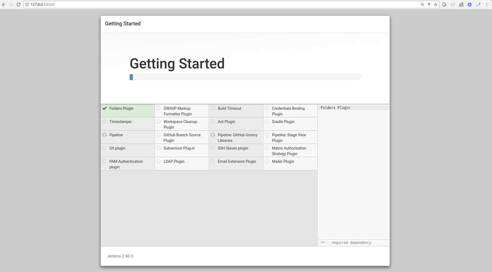

插件安装完毕，根据系统提示，创建一个admin账号

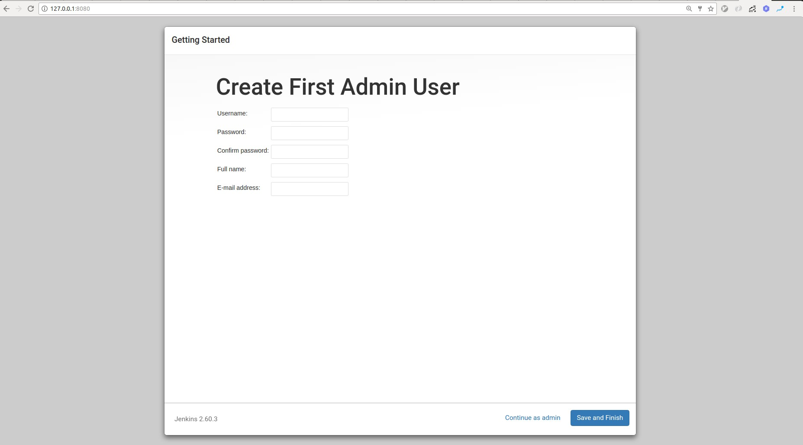

创建完毕
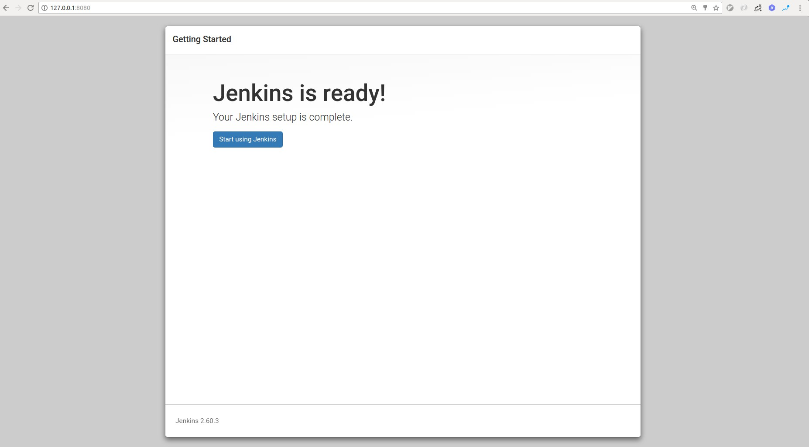

再次欢迎来到 Jenkins 的世界。

## 简单的代码发布架构

为了更容易地理解Jenkins的一些用法和概念，这里介绍一个简单的代码发布架构，框架图如下：

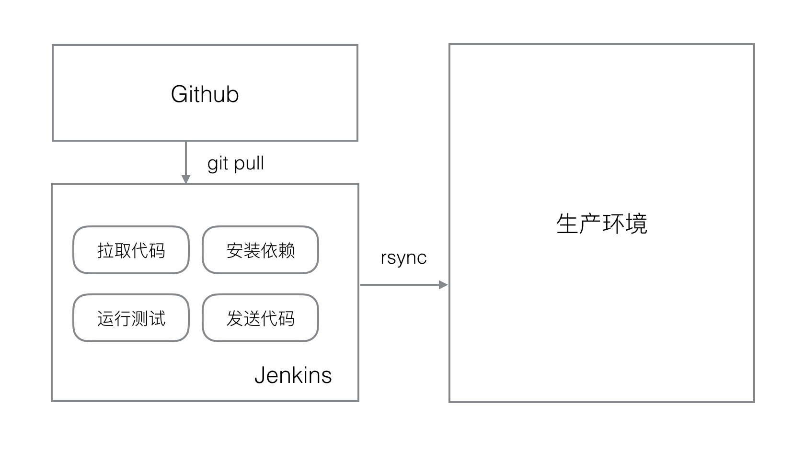

Jenkins做了这些事情：

1. 从 git 上拉取代码
2. 在 Jenkins 中安装项目依赖
3. 在 Jenkins 中运行代码测试
4. 通过 rsync 将代码发送到生产环境

具体操作如下：

点击 [new Item] 之后进入以下页面

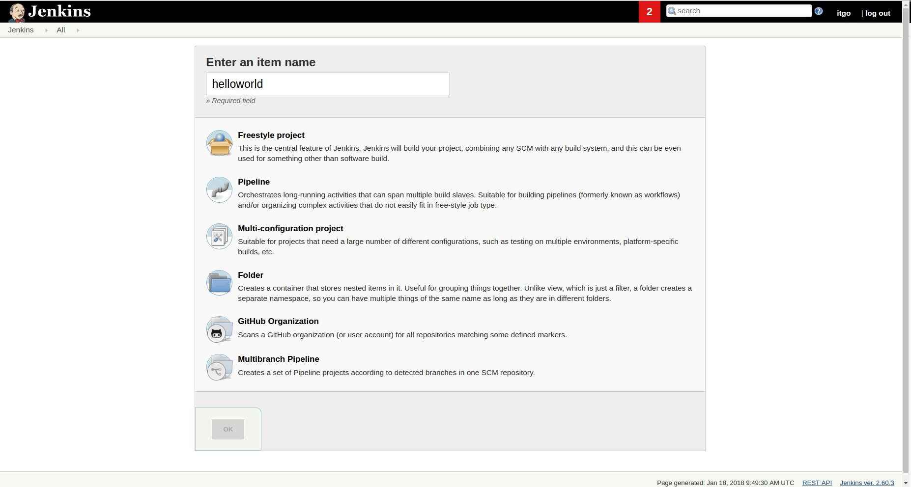

输入项目名称，选择 Freestyle project, 点击[OK]

在Source Code Management 那一栏填入项目地址以及将要拉取的分支

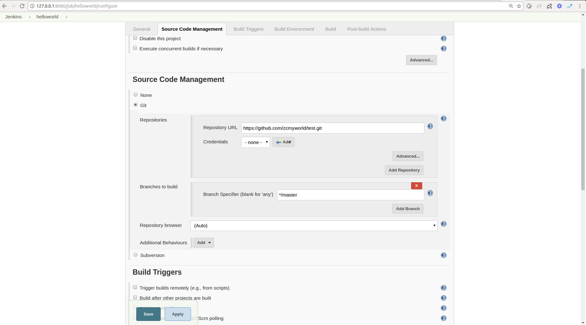

在Build那一栏编写要在项目中执行的脚本（此处全是伪代码，要使用这些命令，还需要在Jenkins中安装Node的环境和rsync 

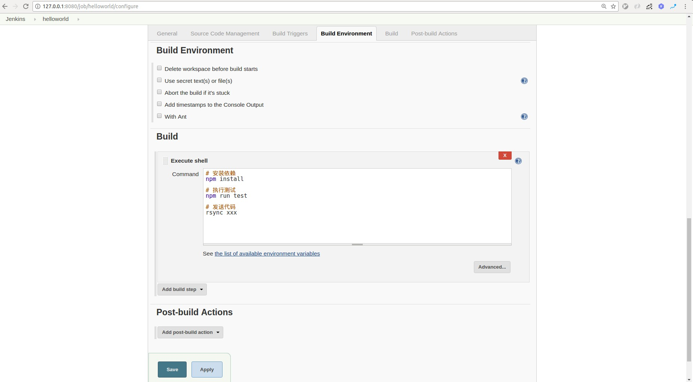

点击 [Save] 按钮保存配置。再点击 [Build Now] 就可以完成这次构建

## 处理私有仓库

如果上述步骤中，git 仓库地址是私有仓库，要怎么获取这个权限？

以我的一个 gitee 私有仓库为例，如果Jenkins并不具有拉取权限，会有显示如下：

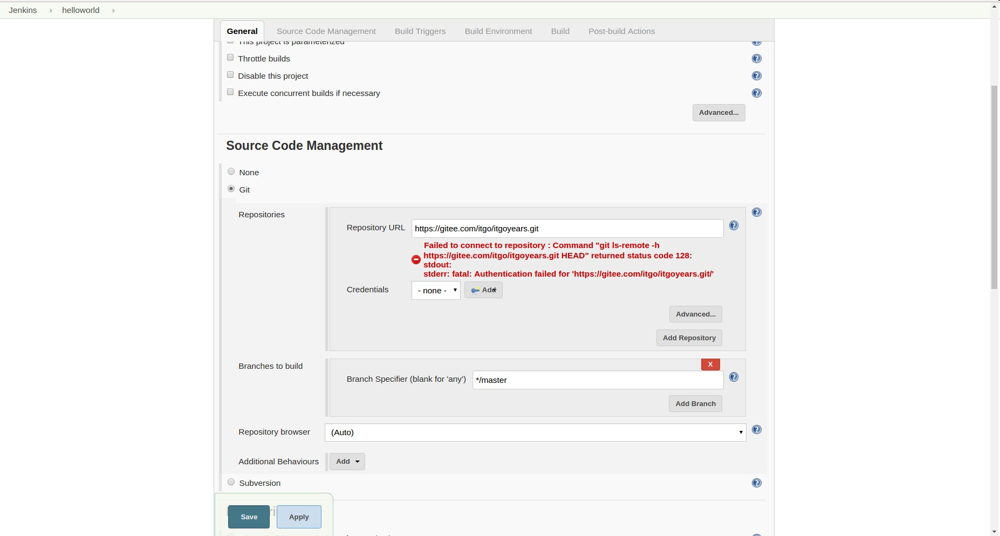

点击 [Credentials] 旁边的 [Add] 按钮，出现以下弹框：

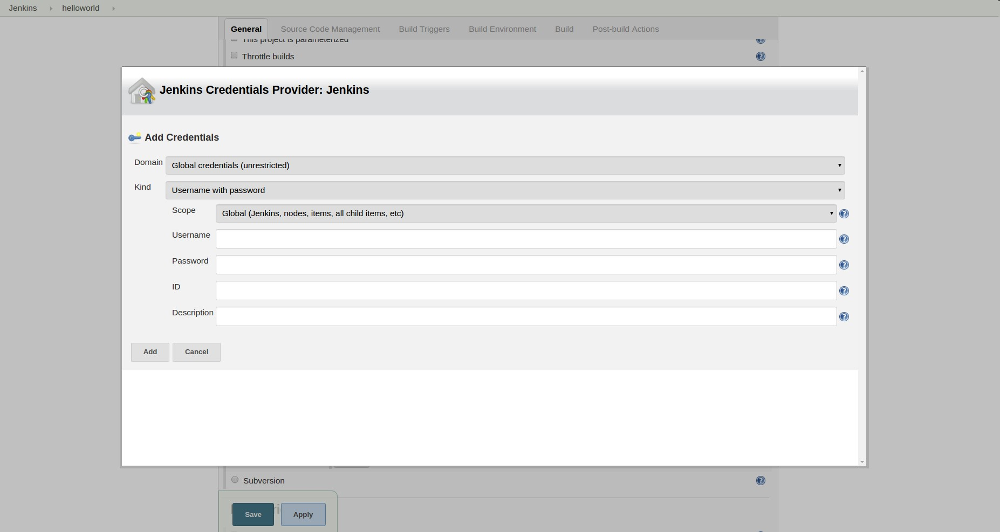

在 Username 一栏填入gitee的账号
在 Password 一栏填入gitee的密码
在 ID 一栏填入一个字符串作为这个账号在Jenkins的唯一ID
在 Description 填入关于这个账号的描述
点击 [Add] 按钮添加完毕。最后在 Credentials 旁边的下拉框选择刚刚添加的账号即可

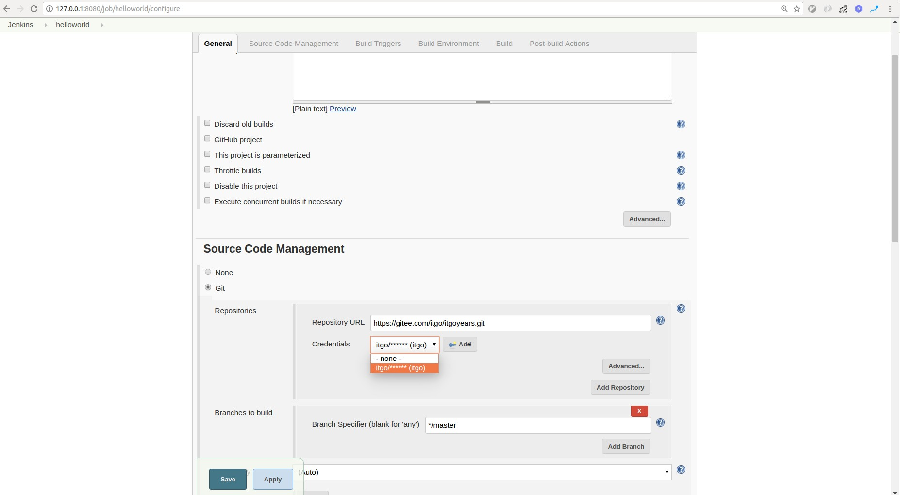

## 多用户与权限管理

目前为止，Jenkins只有一个初始时创建的账号。如果团队开发中，所有人都使用同一个账号，结果可能是灾难的。通过点击按钮

	[Manage Jenkins] ->[Manage Users] -> [Create User]
	
可以创建多个账号。

在登录新创建的账号后会发现这个账号对Jenkins的操作权限几乎和admin的一致。事实上，每个成员都只能管理自己所属的项目才是良好的设计。通过 Role-based Authorization Strategy 这个插件可以帮助我们实现这个功能。

在插件管理器里面找到这个插件

	[Manage Jenkins] -> [Manage Plugins] -> [Available]

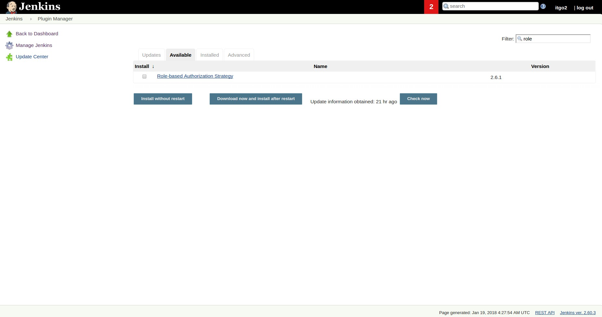

选择 [Install without restart]

安装完毕后，在全局安全配置中将授权改为使用Role-Based策略

	[Manage Jenkins] -> [Configure Global Security]

在 Access Control / Authorization 一栏选择 Role-Based Strategy

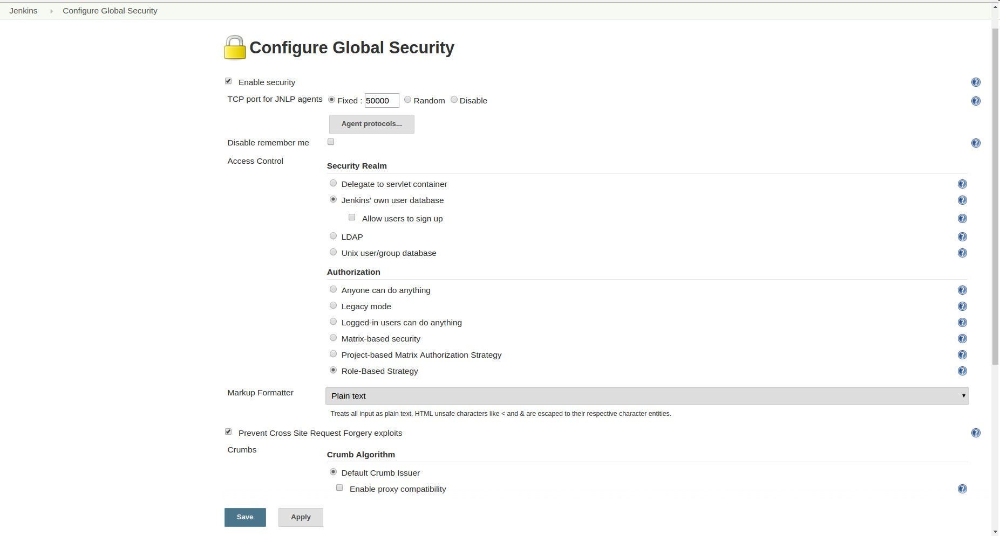

编辑完毕后，进入 [Manage Jenkins] 会发现多了 [Manage and Assign Roles]选项。

如果使用非admin帐号打开Jenkins，会显示禁止访问

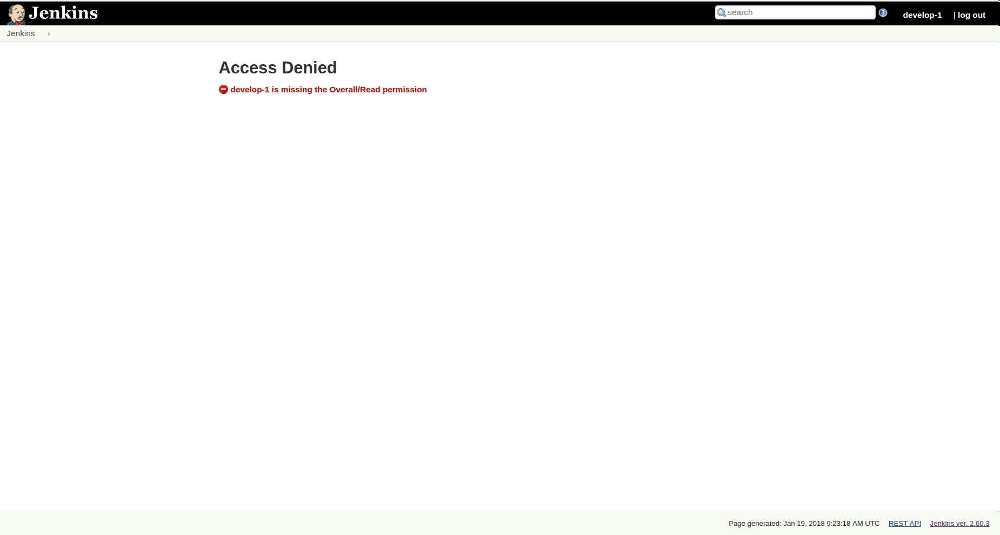

设有 project-1 和 project-2 两个项目，分别由用户 develop-1 和 develop-2 所负责，目标是当登录 develop-1 用户的时候，只看到 project-1 这个项目，develop-2 用户登录时只看到 project-2 这个项目。现在 admin 的视觉是这样的：

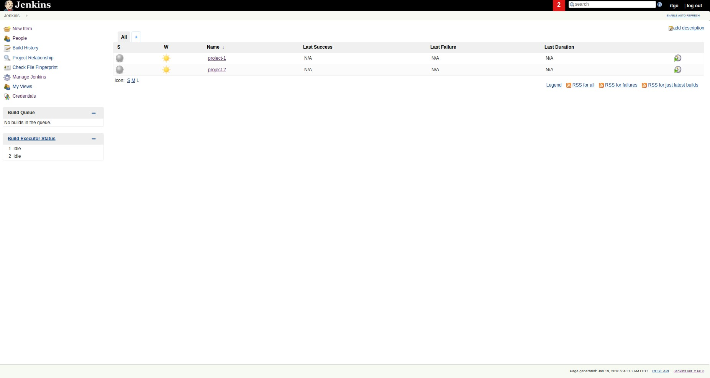

通过点击 

	[Manage Jenkins] -> [Manage and Assign Roles] -> [Manage Roles]
	
创建权限角色。

在 Global roles 那一栏的 Role to add 里面新增 develop 角色，并只勾选 Overall 里面的 Read 选项。即允许develop角色拥有访问 Jenkins 的权限。

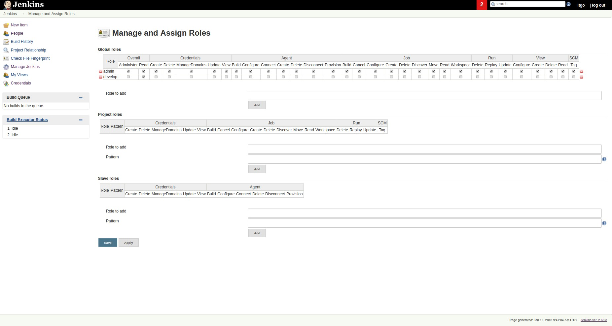

通过点击

	[Manage Jenkins] -> [Manage and Assign Roles] -> [Assign Roles]
	
来授予用户权限。

在 Global roles 那一栏的 User/group to add 里面新增用户 develop-1 并授予develop权限。点击 [Save]，这时，登录 develop-1 用户所看到的界面是这样的：

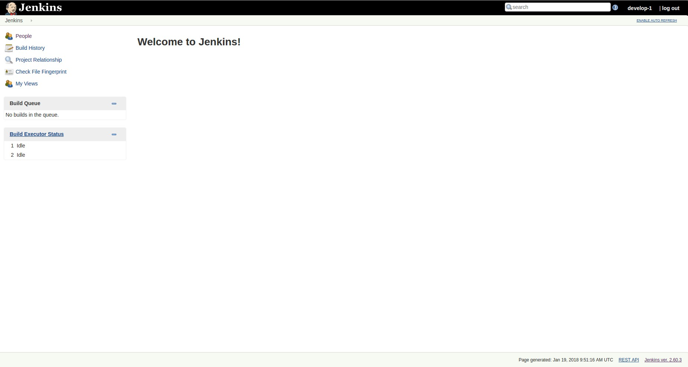

这时候 develop-1 仅拥有访问 Jenkins 的权限，但还不具有操作具体项目的权限。

再回到 admin 用户，通过点击

	[Manage Jenkins] -> [Manage and Assign Roles] -> [Manage Roles]
	
创建项目权限

在 Project roles 一栏中的 Role to add 里面填写 project-1 , 在 Pattern 里面填写 project-1.* ，点击 [Add] 再勾选 Build, Cancel, Configure, Read, Workspace 权限，点击 [Save] 保存配置。修改后配置如下：

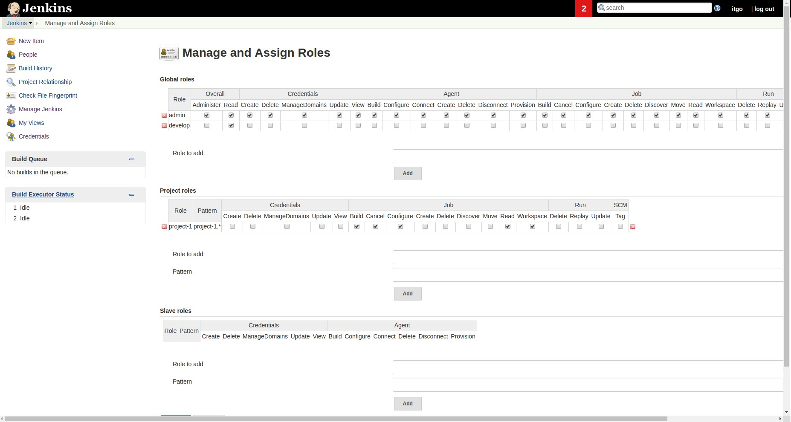

再通过点击

	[Manage Jenkins] -> [Manage and Assign Roles] -> [Assign Roles]
	
来授予用户权限。

在 Item roles 一栏中的 User/group to add 里面填写 develop-1 (就是要被授予权限的用户名)，点击[Add]后勾选  project-1 。 点击[Save]后配置如下：

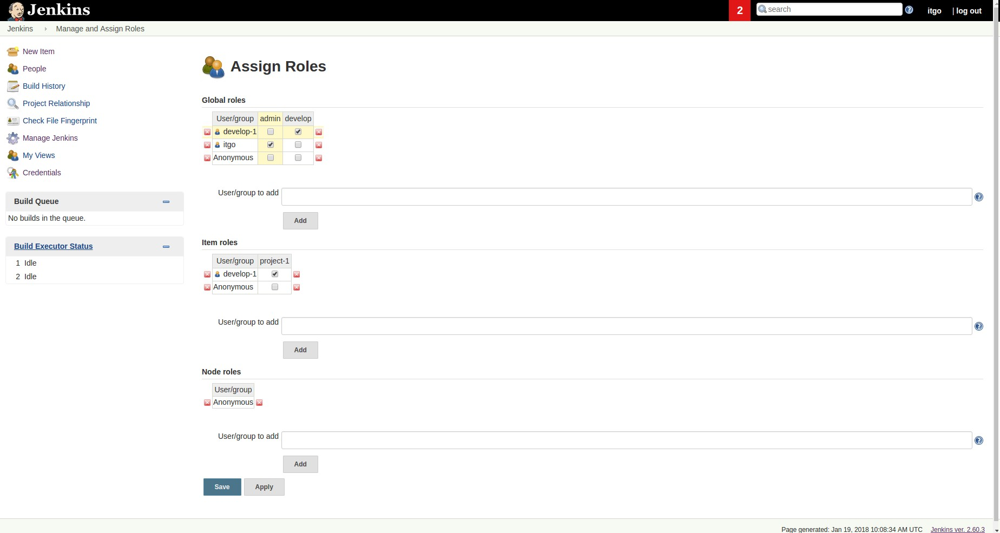

再登录 develop-1 用户，看到的界面如下：

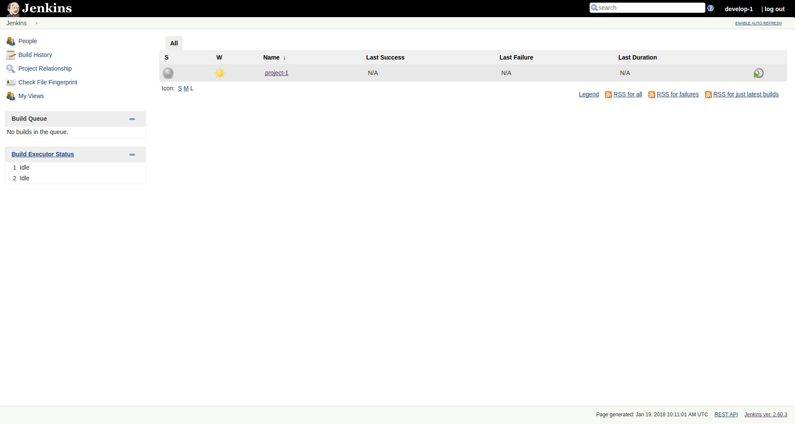

这里，已经完成了用户的项目权限授予，develop-1 用户只能访问 project-1 这个项目。

## 邮件通知

不同的项目构建锁所花的时间不同，有些项目构建只需几秒，有些项目构建可能要好几分钟甚至更长。我们肯定不希望在项目构建的时候一直盯着 Jenkins 看，在多人协作的情况下，也不希望每次构建完毕都要逐一通知团队成员。这里推荐使用 Jenkins 的邮件服务，通过邮件来告知项目的构建状态，用到了 Email Extension Plugin 这个插件。有些版本的 Jenkis 在推荐安装的时候已经安装好该插件，有些版本则没有，可以通过点击

	[Manage Jenkins] -> [Manage Plugins] -> [Installed]
	
来查看该插件是否已经被安装。

确认安装成功后，使用该插件前，先配置 Jenkins 将用于发送邮件的帐号信息。点击

	[Manage Jeknins] -> [Configure System]
	
进入系统配置。

在 System Admin e-mail address 一栏填入由于发送邮件的账号名称

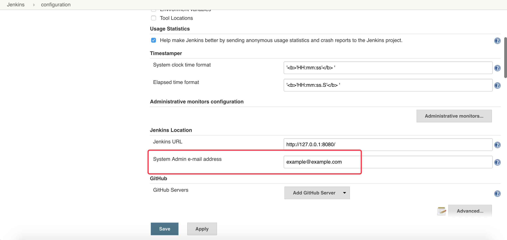

在 Extened E-mail Notification 里面配置账户信息，这里使用腾讯邮箱，所以 SMTP server 使用的是smtp.exmail.qq.com。

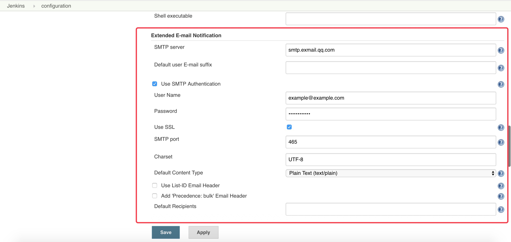

填写完毕，点击 [save]。

至此，邮箱配置完毕。

进入具体的项目配置中，有 Post-build Actions 一栏，点击 [Add post-build action] 下拉框，选择 Editable Email Notification。

可以直接在 Project Recipient List 一栏写上邮件接收方账号，可以使用逗号来区分多个账号。。

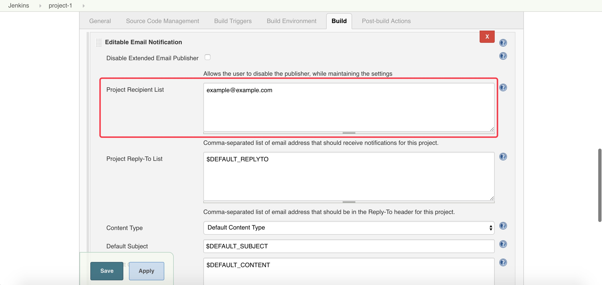

打开下面的 [Advanced Settings...]，可以看到，默认是在构建失败的情况下发送邮件。

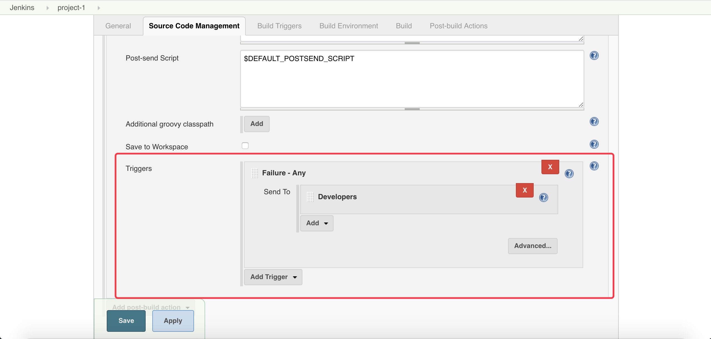

可以通过 [Add Trigger] 修改成 Always ，即每次构建完成（不管失败与否），都会向外发送邮件告知构建状态，修改后如下：

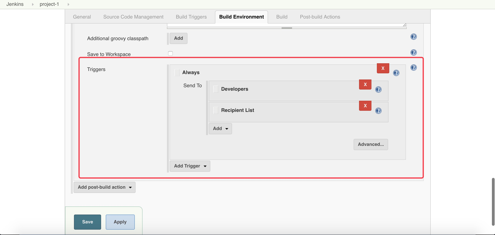

至此，完成构建完成后的邮件通知功能。

## Jenkins主从架构