# 从0开始设计HTTPS

摘要：都知道HTTPS是比HTTP更安全的连接方式，但为什么HTTPS会更安全？因为HTTPS加入了SSL所以更安全，通过搜索引擎，你或许会得出这样的答案。但为什么是SSL，而不设计成其他的样子呢？带着疑问，来尝试从0开始设计一遍HTTPS。

## 对称加密

古时候有两个人，一直通过写信相互联系。

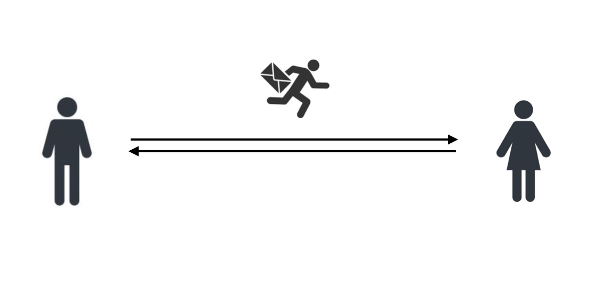

他们总觉得邮差的样子很贼，害怕信件被偷看，

于是一次见面的时候，找来一个带锁的盒子和两把钥匙，商定每次寄信前都先锁上信件。

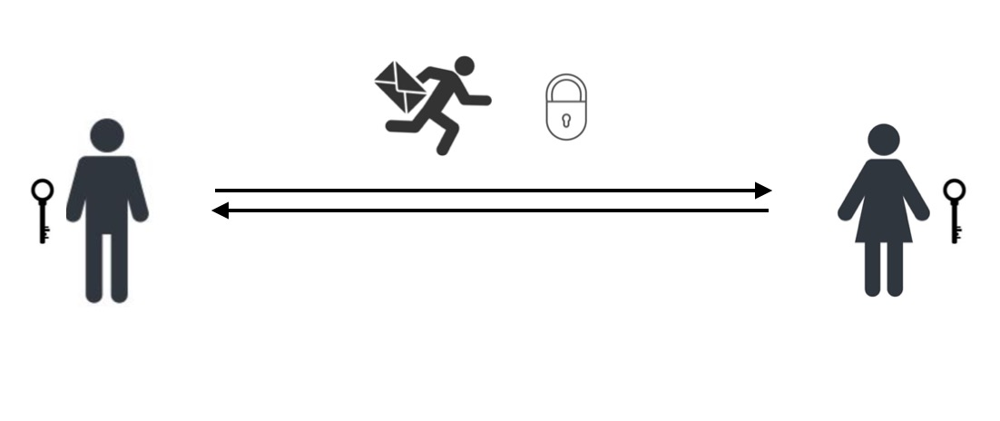

通过这种方式，他们觉得通信已经足够安全了

直到有一天，其中一个人把钥匙弄丢了。

他想要发信通知另一人拷贝一把钥匙发回来，但深想，他没法将“拷贝一把新钥匙给我”这番话进行加密，也没法保证中途钥匙会不会被盗窃啊。

换言之，要继续维持原来的通信方式，只能约对方出来见面再拿新的钥匙了。

如果将这个问题放到当今的互联网，通讯前都要求两个人先见面取钥匙，那显然是不可能的。

## 非对称加密

针对于上述钥匙交换的问题，人们想出了非对称加密的方式。非对称加密算法的实现涉及到一些数学问题，不作详述。

简单来说，非对称加密有公钥和密钥，公钥可以公开由任何人持有，而私钥由自己持有。公钥加密的信息只能由对应的私密解密，同样，私钥加密的信息只能由对应的公钥解密。

利用这个特性，回到上面的例子，可以进行下面的通信方式

先将公钥交给邮差发送给对方

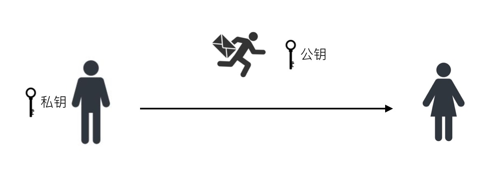

对方使用公钥将信息加密之后将信息返回

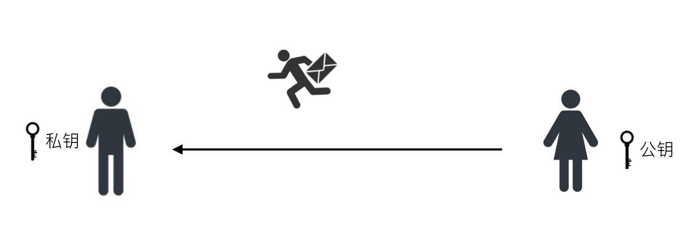

收到信件后，利用私钥对信息进行解密

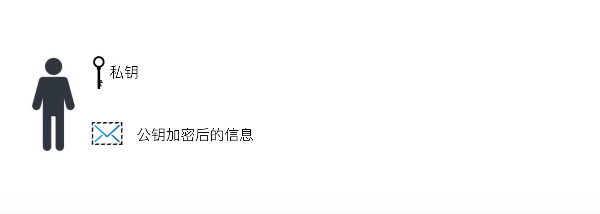

这样就能保证信件的保密传递了。

而由于公钥是允许任何人知道的，如果用私钥将信息加密，被别人窃取后，可以通过公开的公钥来获取信息。所以通信前一定是先获取对方的公钥，只传递公钥加密后的信息。

这样足够安全了吗？并不。

如果有人截取通信，伪装成其中一方，发送伪造方的公钥，就能窃取通讯信息了。

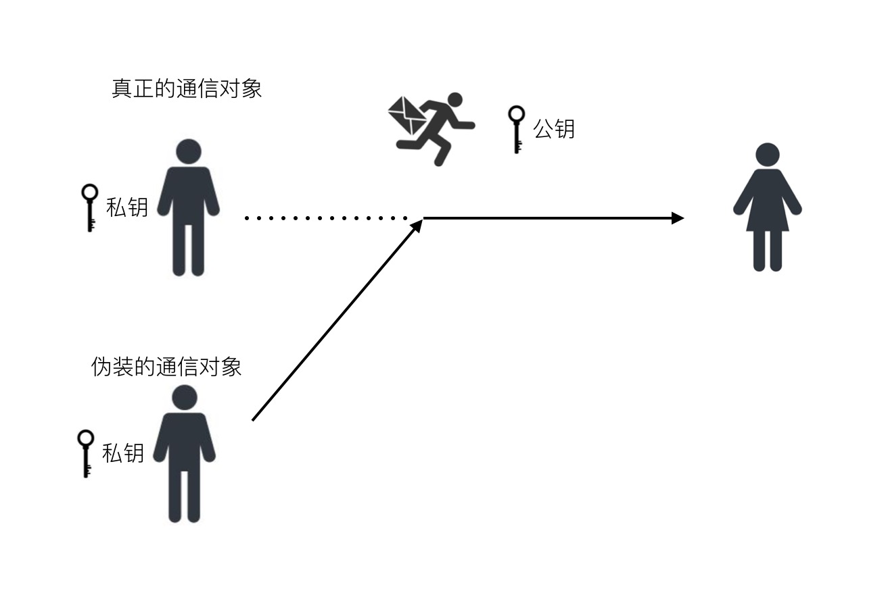

## 认证机构和数字证书

为了保证通信者获取的公钥并没有被恶意替换，可以通过第三方认证机构来确认公钥是否可信。

那么这个认证和检验的过程是怎样实现的呢？

通信的一方需要先向认证机构认证自己的身份。可以将自己的通讯公钥和一些个人信息发送给认证结构，然后认证机构利用自己的私钥来对这些信息加密，生成一份数字证书，这份证书就是用来证明这个人的身份的。

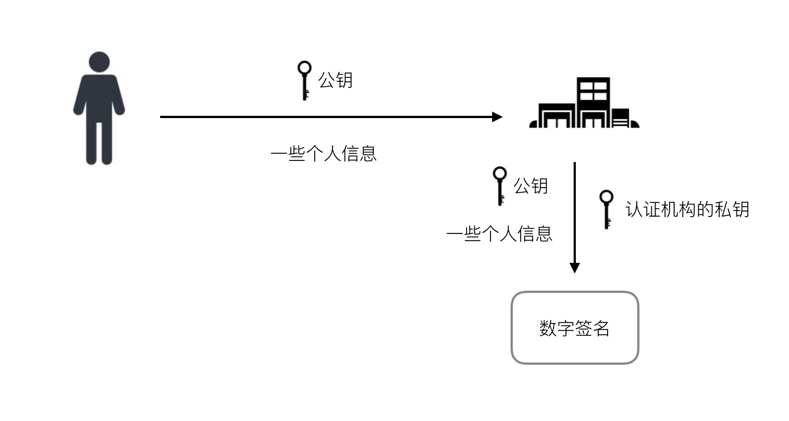

在浏览器中，系统默认就会装有一些认证机构的公钥，称之为顶级证书。

在通讯的时候，先发送数字证书，然后接收方利用顶级证书对这份数字证书进行解密，获得通讯的另一方的公钥，同时利用解密出来的信息进行比对，从而检验出解析出来的公钥是否属于通讯方。

流程如下

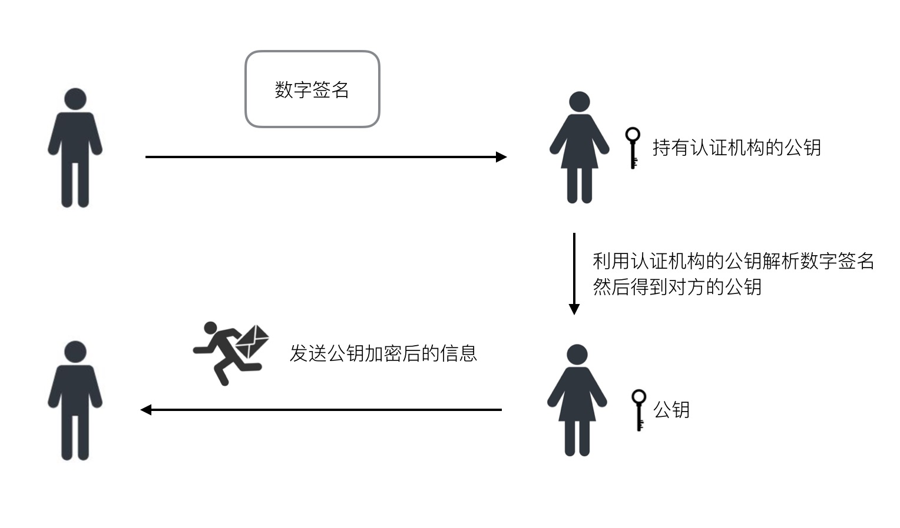

这样，如果顶级证书没有被恶意替换，整个通讯流程就可以认为是安全的。

## 优化通讯性能

再回顾上面的流程

对称加密的弊端是难以安全地传递密钥

非对称加密的弊端是加密和解密的花费时间长，如果通讯中所有数据都使用非对称加密，将会引起性能问题。

如果结合两者，使用机构认证和非对称加密的方式解决密钥传递的问题，使用对称加密的方式来解决加解密费时问题，就能达到性能优化的目的。

如果通讯双方分别是浏览器和服务器，通讯流程将如下

服务器先从认证机构申请数字证书

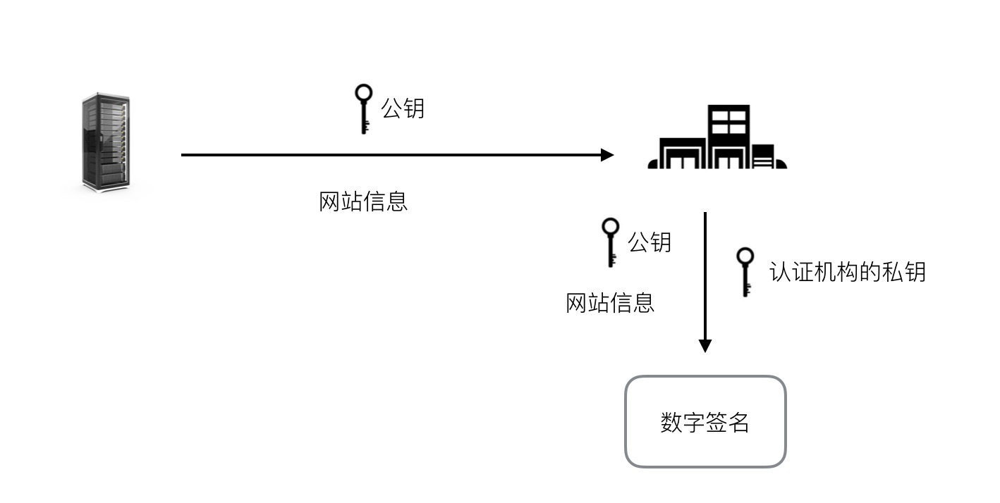

浏览器访问网站，服务器返回数字证书

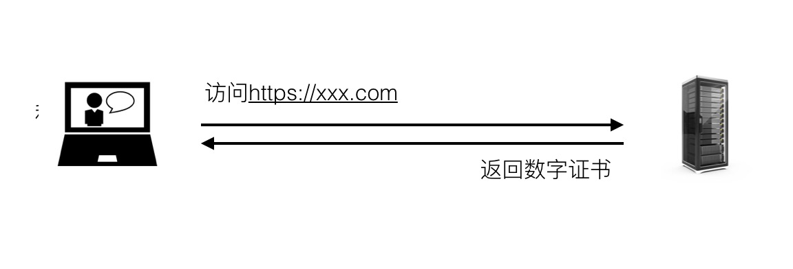

浏览器利用内置的顶级证书解析服务器返回的数字证书得到服务器的公钥

然后浏览器生成一个对称加密的密钥

再利用服务器的公钥进行加密

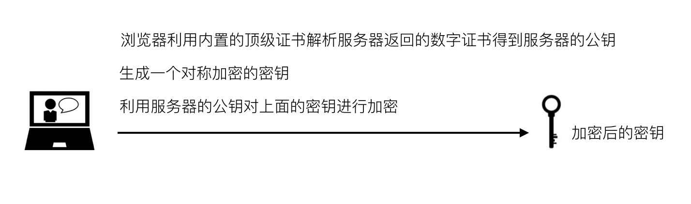

浏览器将加密后的密钥发送给服务器，服务器利用自己的私钥将其解密得到对称加密的密钥，双方将使用该对称加密的密钥进行通讯

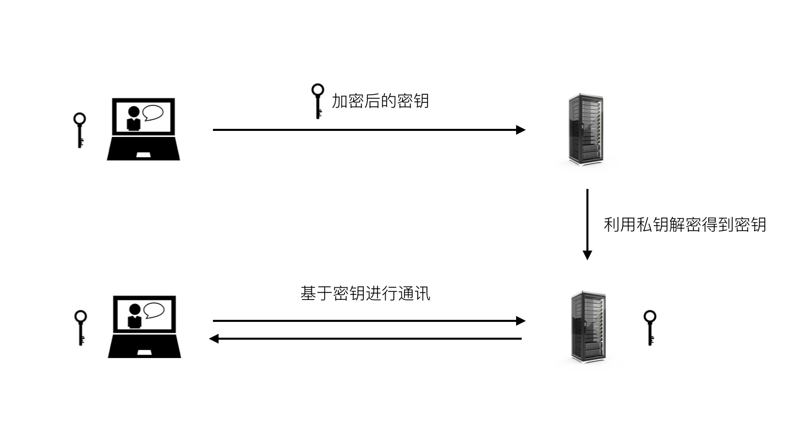

以上，就是HTTPS握手的过程。
e 