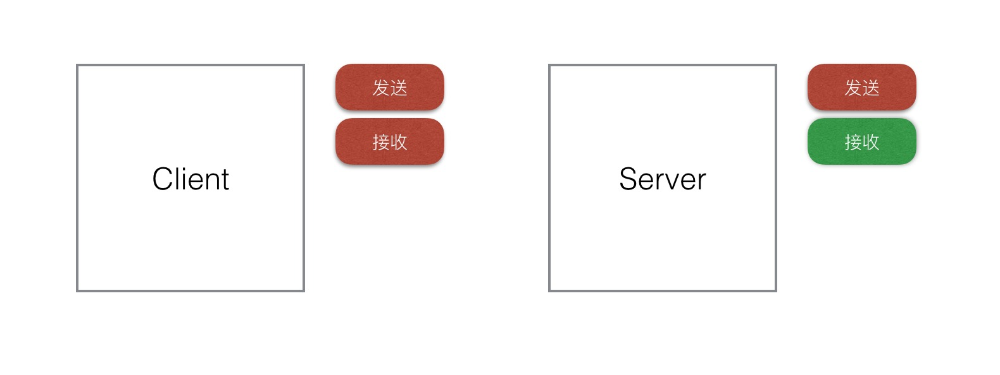

# TCP握手／挥手次数的设计

摘要：TCP建立连接为什么是三次握手，而不是两次或其他？那断开连接为什么是四次挥手呢？

## 三次握手

什么是 TCP 三次握手，很多人第一时间会想到下面的流程图：

这里并不想讨论三次握手的具体实现，而想讨论的是，为什么 TCP 采取的是三次握手，而不是两次或者其他次数。

换言之，如果换成你去设计 TCP 的握手流程，你会设计成多少次？

对于这个问题，首先要考虑的是，握手的目的是什么？

握手的目的是，保证通讯双方建立的连接是可靠的。同时，为了保证性能，握手的次数要求尽可能少。

再细化定义，怎么样才算是“通讯双方建立的连接可靠”？

这里提出一个定义：“通讯双方建立的连接可靠”就是要确保双方的发送和接收功能都正常。举个生活中的例子，就是打电话通话前，要先确认双方的听筒和麦克风是否正常。

以下图为例，在握手前，双方的发送和接收能力尚未确认。

第一次握手：

客户端向服务端发送信息。当服务端接收到信息后，服务端可以明确接收功能是正常的。

第二次握手：

服务端向客户端发送信息作为应答。当客户端接收到信息后，客户端可以明确发送和接受功能都正常。

第三次握手：

客户端向服务端发送信息，当服务端接收到信息后，服务端可以明确发送功能是正常的。

通过三次握手，就能明确双方的收发功能均正常，也就是说，保证了建立的连接是可靠的。

## 四次挥手

和上面一样，这里并不讨论挥手的具体实现。

挥手的目的是为了确保双方都不再需要向对方发送数据，继而可以关闭连接。

通俗来说，就是己方不需要发送数据了，同时确保对方也不需要向自己发送数据。

以下图为例，在挥手前，双方都未知对方是否需要向自己发送数据。

第一次挥手：

客户端向服务端发送断开信号。服务端接收到这个信号后，确认客户端不再需要发送数据。

第二次挥手：

服务端接收到客户端的断开信号后，可能还在处理客户端之前的请求，所以不能马上回应断开信号。而如果等待请求处理完毕再发送断开信号，等待时间可能过长，以致于客户端没有接收到服务端的响应，误以为丢失了数据，会触发重试或其他操作而引发错误。所以设计了第二次挥手用语应答，客户端可以确认对方收到了自己的断开信号。

第三次挥手：

服务端处理完所有请求后，向客户端发送断开信号。客户端接收到这个信号后，明确对方不再需要发送数据。

第四次挥手：

客户端向服务端发送消息作为应答，使得服务端可以确认对方收到了自己的断开信号。

上面的例子为客户端先向服务端发送断开新号，事实上，可以由客户端发送，也可以由服务端发送。