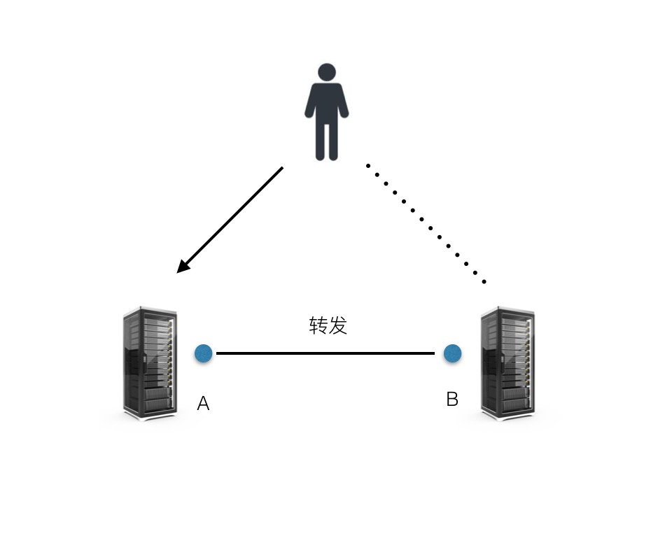
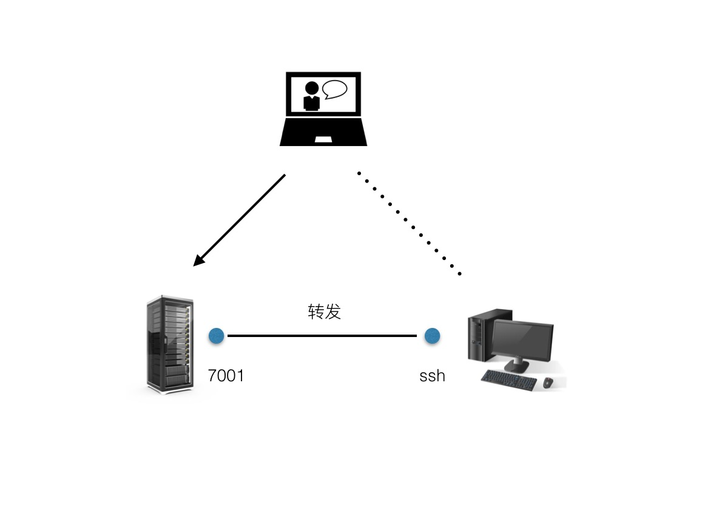
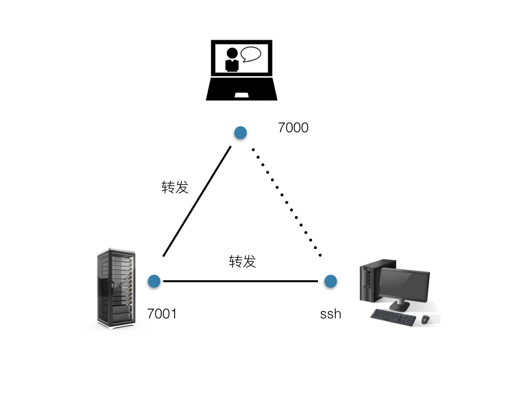

# 一条命令用上闲置的办公室电脑

摘要：如果你也有下班不关机的习惯，一定会想过怎么利用它的闲置时间。

## 角色说明
要做到下面效果，其实还需要：

* 24小时不关机的办公室电脑（下文简称闲置机器
* 拥有公网IP的一台服务器（下文简称为公网服务器
* 用来登陆公网服务器或者办公室电脑的笔记本（下文简称为移动终端

## 实现原理 - SSH端口转发

SSH提供端口转发的功能。它能够将其他 TCP 端口的网络数据通过 SSH 链接来转发，并且自动提供了相应的加密及解密服务。换言之，如果A机器的A端口和B机器的B端口建立了SSH链接并使用SSH来实现端口转发，当用户访问A的机器的A端口的时候，信息会被转发到B机器的B端口，实际访问的是B机器上的服务。

## 远程连接

基于上面的想法，如果将公网服务器上某个端口转发到闲置机器的 ssh 端口上，就可以实现通过 SSH 远程连接闲置机器了。

在闲置机器中使用命令

	ssh -CfNg -R 7001:localhost:22 user@ip
	
将公网服务器的 7001 端口映射到闲置机器的 22 端口，7001 为任意端口，可以是其他，22为闲置机器的SSH端口，user为公网服务器的 user，ip为公网服务器 IP。

在闲置机器上再执行

	lsof -i:22

可以看到已经建立的链接。

这时候，通过SSH登陆到公网服务器，再执行

	ssh -p 7001 user@localhost

就可以登陆到闲置机器上了。

其中，7001 为上面配置的映射端口，user是闲置机器的 user，localhost就是localhost或者127.0.0.1。

这样，只要在有网络的地方，就可以远程控制到办公室的机器了！

## HTTP服务

SSH端口转发能实现SSH服务的转发，当然也能实现 HTTP 服务的转发。

假设在闲置机器上运行了一个HTTP服务，监听3000端口。

在闲置机器上执行命令

	ssh -CfNg -R 7002:localhost:3000 user@ip
	
将公网服务器的 7002 端口映射到闲置机器的 3000 端口。

那么，登录到公网服务器再执行

	curl 127.0.0.1:7002

就可以看到闲置机器上的 HTTP 服务返回了数据。那么，再使用 Nginx 对该端口进行代理，就能通过浏览器访问到闲置机器上的网页数据。

搭建一个简单的HTTP文件服务器，就能利用上闲置机器的硬盘资源，相对于昂贵的云硬盘来说，这种方法可以说是相当经济啊。

## 文件传输

上面提到可以搭建一个HTTP文件服务器来管理个人文件。
再细想，既然建立了 SSH 连接，再使用 scp 或者 rsync 命令将文件传输到闲置机器来实现文件保存那是更好了。

在移动终端执行

	ssh -CfNg -L 7000:localhost:7001 user@ip

user为公网服务器的用户，ip为公网服务器的IP。将移动终端的 7000 端口映射到公网服务器的 7001 端口，而 7001 端口又通过上面的命令转发到了闲置机器的22端口。

像类似这样执行 scp 命令

	scp -P 7000 test.txt user@localhost:~/Downloads
	
就可以将移动终端的 test.txt 这个文件拷贝到闲置机器的 Downloads 目录下。其中user是闲置机器的user，localhost是就是localhost或者127.0.0.1。

当然，执行上面命令后，可以直接在移动终端执行

	ssh -p 7000 user@localhost
	
通过SSH连接到闲置机器上。

## SSH会话

SSH会话是有时间限制的，一段时间没有数据通讯，系统会自动断开 SSH 连接。

可以写一个脚步来定时通过SSH链接发送数据实现心跳的效果

而更便捷的方式是利用SSH自带的心跳功能

在闲置机器的 /etc/ssh/ssh_config 文件中增加一行配置

	ServerAliveInterval 30
	
就会每30秒向服务器发送一个心跳包，也有服务端发送心跳包的配置，不详述。

