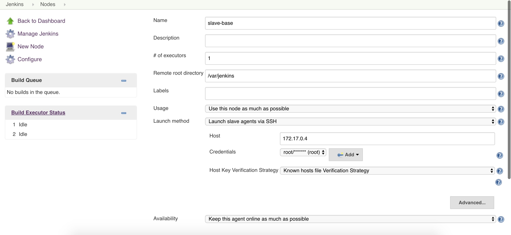
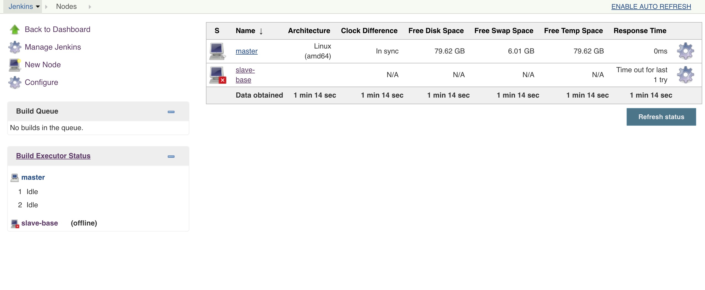

# Jenkins的Master/Slave架构

摘要：Jenkins Master/Slave 架构的简单介绍。使用Docker来构建Master/Slave架构。

## 架构简介

如果Jenkins所需要执行的任务非常单一，Master/Slave 的架构并不能体现什么优势。

举个例子，如果只对单个 Node.js 的项目进行打包发布，直接在 Jenkins 机器上安装对应的环境是最快捷的。

但假如业务场景变得复杂，不同的任务需要使用不同的 Node.js 版本进行打包，又或者一些项目使用 PHP 的运行环境，而其他些项目需要 Python 的运行环境。这时候单个执行环境有显得不足，可以考虑配置多个不同的 Slave 来弥补这一点。

在实际运行中，Master机器起到了统筹管理的作用，而Slave机器执行具体的Jenkins任务。

使用 Master / Slave 架构远不止解决了项目构建的问题。将不同任务分发到不同机器，能避免单机性能不足的问题，而当单机性能到达瓶颈的时候，也可以轻易平衡扩展。

## 配置方法

使用 Jenkins Slave 可以很好地解决运行环境多样的问题，但如果每一个环境都配有专门的节点运行，成本耗费会很高。

使用 Docker 能很好地解决这个问题。

Docker能轻易在单台节点上运行多个容器，每个容器上安装有不同的运行环境，将容器作为 Jenkins Slave 非常合适。下面介绍使用 Docker 构建 Master/Slave 架构的配置方法。

1.编写用于作为Slave节点的容器Dockerfile

Jenkins Master 和 Slave 之间可以通过 SSH 进行通讯，同时要求 Slave 节点上拥有Java的运行环境。所以 Dockerfile 里面主要安装 openssh-server 和 Java 的运行环境。值得注意的是，不同的 Jenkins 版本对于 Java 版本的要求不同，如果版本不一致，会导致添加失败。这里使用的Jenkins版本是2.60.3，对应的是Java8。最终编写Dockerfile如下：

	FROM ubuntu:14.04
	MAINTAINER zhicong
	
	RUN apt-get update
	
	# sshd
	RUN apt-get install -y openssh-server
	RUN mkdir /var/run/sshd
	RUN echo "root:pwd" | chpasswd
	RUN sed -i "s/^PermitRootLogin without-password/PermitRootLogin yes/" /etc/ssh/sshd_config
	
	# java
	RUN apt-get install -y python-software-properties
	RUN apt-get install -y software-properties-common
	RUN add-apt-repository -y ppa:webupd8team/java
	RUN apt-get update	
	RUN echo oracle-java8-installer shared/accepted-oracle-license-v1-1 select true | /usr/bin/debconf-set-selections
	RUN apt-get install -y oracle-java8-installer

其中，使用的是 ubuntu 14.04 ，root帐号密码是 pwd

执行以下命令将 Dockerfile 打包成镜像，镜像名称 jenkins-base
	
	docker build -t jenkins-base .
	

执行以下命令生成容器 

	docker run -dt jenkins-base
	

2.在Jenkins UI上添加节点
	
点击 [Manage Jenkins] -> [Manage Nodes] -> [New Node]进入以下页面

命名节点名称后点击 [OK]

设置 Remote root directory	地址

在 Launch method 这一栏选择 Launch slave agents via SSH

在 Launch method 下中 Host 这一栏填写容器的 ip

在 Credentials 中加入访问容器的 SSH 帐号。账号对应的是上面创建的容器，root密码是pwd

配置完成下，如下：

点击保存后，可以看到 slave-base 已经添加到节点列表，但是处于脱机状态。

点击这个slave的名字，可以查看该节点的状态。

点击 [Launch agent]，会看到以下输出，表示节点安装成功。

至此，Slave节点添加完毕。

3.使用添加的 Slave 节点

在创建任务的时候，在 Restrict where this project can be run 这一栏中可以指定执行的节点

## 最后
